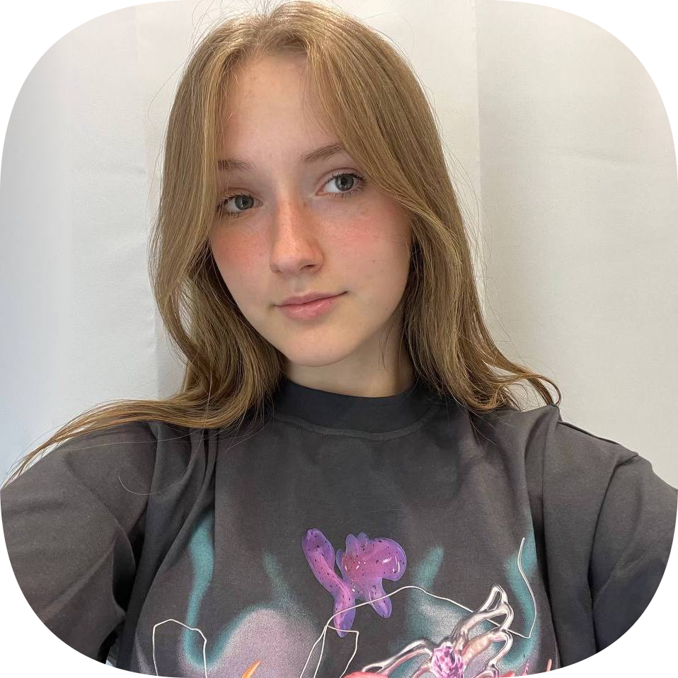

# Прусская Мария

 UX/UI-дизайнер 

 

# Образование

### Основное:
* Детский сад №325 11', Красноярск, Россия;
* МАОУ Средняя школа-интернат №1 имени В. П. Синякова 12', Красноярск, Россия;
* МБОУ Солонцовская СОШ им.генерала С.Б.Корякова 13', Красноярск, Россия;
* МБОУ Емельяновская СОШ №1 17', Красноярск, Россия;
* МБОУ Емельяновская СОШ №3 19', Красноярск, Россия;
* Физико-математическая школа СФУ 23', Красноярск, Россия;
* Бакалавр Системного анализа и управления в ИКИТ СФУ 27', Красноярск, Россия.

### Дополнительное:
* Skillfactory & Contented 'Курс UX/UI с нуля до PRO'
* МБОУ ДО ДЮСШ Емельяновского района имени В.Н.Назарова в секции 'Волейбол' 
* МБУДО 'Детская школа искусств', инструмент: гитара

